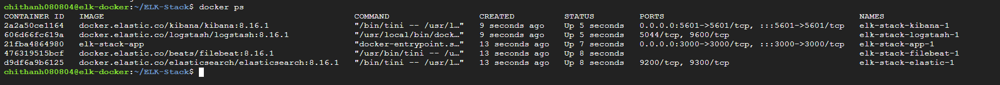
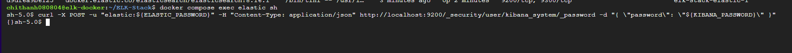
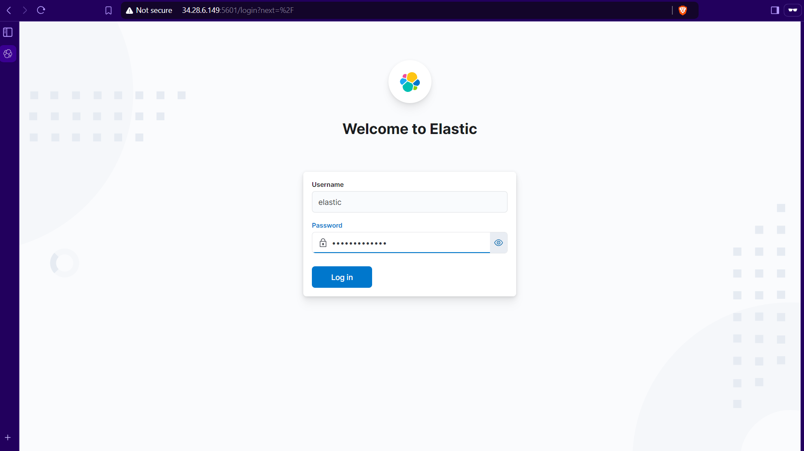
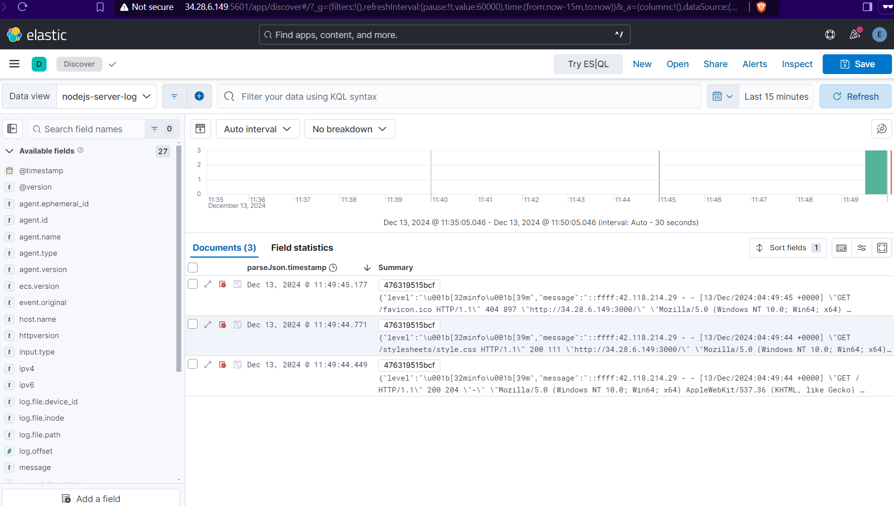

# Docker with ELK Stack

The purpose of this project is to deploy an ELK stack system to monitor the logs of Node.js application

This repository contains a Node.js application using Express.js, Docker, and the ELK stack(Elasticsearch, Logstash, Kibana, Filebeat) for logging and monitoring.

## Prerequisites

- Docker 
- Docker Compose

## Getting Started

### Clone the repository 

```bash
git clone https://github.com/Thanh8804/ELK-Stack.git

cd ELK-Stack
```


### Build and Run the Application

```bash
docker compose up -d
```


Access Kibana

1. Kibana will be available at http://localhost:5601

2. When the user first accesses Kibana, it will display "Kibana server is not ready yet" because Kibana is not authenticated with Elasticsearch

3. To resolve this, access the Elasticsearch container and set password for kibana. 


```bash
docker compose exec elastic sh

curl -X POST -u "elastic:${ELASTIC_PASSWORD}" -H "Content-Type: application/json" http://localhost:9200/_security/user/kibana_system/_password -d "{ \"password\": \"${KIBANA_PASSWORD}\" }"

```


4. After setting the password in the Elasticsearch container, you will be able to access the Kibana dashboard. Log in to Kibana:

    Username: elastic

    Password: myelasticpass



5.This is the log data of the Node.js application Which is recieved by kibana 

